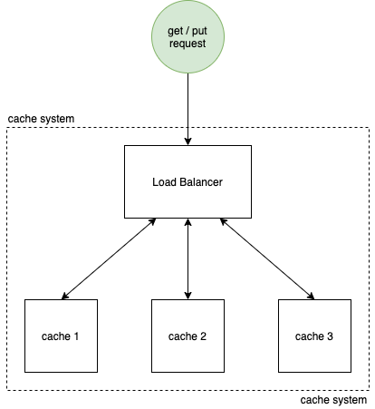

# Distributed Cache
This application is a simple version of a distributed cache that stores data in-memory and exposes HTTP REST endpoints to save and query data. I have used Kubernetes to scale & orchestrate the system. The cache is implemented in-memory using LRU. More info about LRU cache [here](https://www.youtube.com/watch?v=DUbEgNw-F9c&t=12s). For efficient distribution of cache data across several servers I have implemented the well known Consistent Hashing algorithm from scratch. You can find more information on Consistent Hashing [here](https://www.toptal.com/big-data/consistent-hashing).



# Prerequisites 
1. Node JS [Link](https://nodejs.org/en/download/)
2. Docker Desktop [Link](https://www.docker.com/products/docker-desktop)
3. Enable Kubernetes using Docker Desktop [Link](https://birthday.play-with-docker.com/kubernetes-docker-desktop/#2-enable-kubernetes)

# Running the application
1. `cd` into project root folder
2. Run the following kubectl yaml setup script for cache servers and load balancer
```
kubectl apply -f cache-servers.yaml && kubectl apply -f cache-loadbalancer.yaml
```

# API
### Save data to cache
```
Method: POST 
Url: <domain:32222>
Body:
{
  "key": {key},
  "value": {value}
}
```
For eg,
The following request saves the value `value_123` under the key `123`
```
curl --header "Content-Type: application/json" --request POST --data '{"key":"123","value":"value_123"}' localhost:32222

Response:
{
  "message":"success"
}
```

### Get data from cache
```
Method: GET 
Url: <domain:32222>/{key}
```
Example 1: The following request gets value for the key `123`
```
curl localhost:32222/123

Response:
{
  "message":"success",
  "value":value_123
}
```
Example 2: The following request returns `null` for key that is not present in cache `invalid_key`
```
curl localhost:32222/invalid_key

Response:
{
  "message":"success",
  "value":null
}
```

# Benchmarking
I have benchmarked the cache hit and cache miss numbers. Described below are the observations taken for storing 2000 keys in the cache. 

## Running the benchmark
1. `cd` into /benchmarks
2. Install node dependencies
```
npm i
```
3. Start the application
```
node index.js
```

## Observations
### Initial Run
```
Request Count : 2000
Cache Hit Count : 2000
Catch Miss Count : 0
Catch Hit Percent : 100%
Cache Miss Percent : 0%
```

### Run after adding a cache server
```
Request Count : 2000
Cache Hit Count : 1475
Catch Miss Count : 525
Catch Hit Percent : 74%
Cache Miss Percent : 27%
```
As seen in the above logs upon adding a cache server we see only **27%** of the requests that are not present in cache. This is because we are using Consistent Hashing technique which minimizes the keys that are relocated amongst servers. Instead if we were using any normal Hashing technique like modulo hash function `hash(key) mod N` where `N` is the count of cache servers, we would be having ~100% cache miss because all key locations would have changed. 

## How Tos
### Add/Remove a cache server
1. Open cache-servers.yaml file
2. Modify `replicas` parameter to the desired number of cache server replicas
3. Save cache-servers.yaml
4. Open cache-loadbalancer.yaml file
5. Modify the `CACHE_SERVERS` env variable based on the replica count. For eg, if there are 2 cache server replicas then the `CACHE_SERVERS` env variable would look like the following
```
http://cache-0.cache.default.svc.cluster.local:8080 http://cache-1.cache.default.svc.cluster.local:8080
```
In general the cache server internal private ip (cluster ip) would take the following form `http://cache-N.cache.default.svc.cluster.local:8080` where N is the index of cache server replica.

6. Rerun the application as described [here](#Running-the-application)

